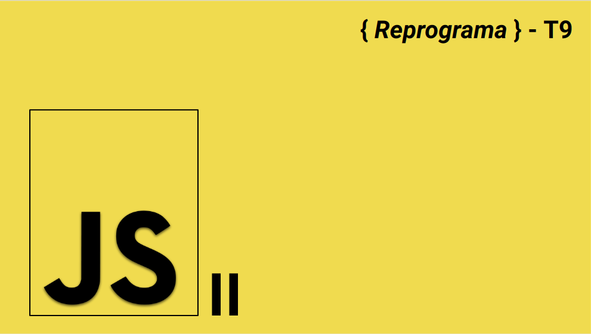

  

## Javascript II - Manipulando o DOM

### :memo: O que vamos ver durante essa semana:

- Por que e como usar o JS dentro do HTML
- O que é o DOM
- Como acessar e manipular o conteúdo do HTML pelo DOM
- Eventos no Browser
- Formas de usar eventos na Web
- Objeto evento

### [Link das aulas aqui.](https://docs.google.com/presentation/d/1fHLgwoPZu7CRHjcgtvgupeYj92Aeg_3W6QVd9rMhb0Q/edit?usp=sharing)

